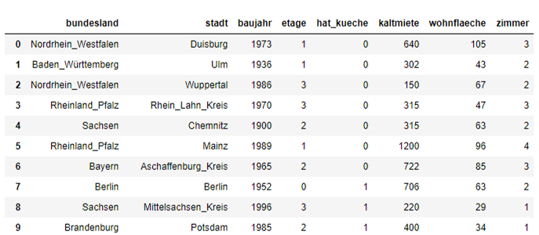

# Was ist Data Science? 

Data Science umfasst unter anderem folgende Aufgaben:

1.  Strukturieren/Aufbereiten (Umgehen mit falschen, korrumpierten, fehlenden,
    unformatierten Daten)

2.  Data Exploration (Daten "verstehen")

3.  Data Analysis (quantitative Analysen, Hypothesen aufstellen)

4.  Data Visualization (Hypothesen graphisch kommunizieren)

5.  Modelle erzeugen/validieren (Regeln/Muster erkennen, Vorhersagen treffen) -- das ist Machine Learning aber es gibt auch viele andere Ans&auml;tze.

6.  Daten Reduktion

## Wie passiert die Datenanalyse?

Mit mathematischen Methoden aus den Bereichen der

 * linearen Algebra (z.B. Matrizen, Basen, lineare Gleichungssysteme)
 * Statistik (z.B. Mittelwerte, Korrelationen, Verteilungen)
 * Analysis (Grenzwerte, Absch&auml;tzungen)
 * ...

Dabei hilft Software, z.B.,

 * Excel
 * **Python**
 * Matlab
 * R

bei der Berechnung, Automatisierung, Visualisierung.

> Python ist ein de-facto Standard in Data Science und Machine Learning.

## Was sind Daten?

Wie sehen Daten aus?

-   Numerisch reell, z.B. Temperatur

-   Numerisch diskret, z.B. Anzahl

-   Ordinal: Element einer festen Menge mit expliziter Ordnung, z.B.
    {neuwertig, mit Gebrauchsspuren, defekt}

-   Binär: Eine von zwei Möglichkeiten, z.B. Wahr/Falsch oder aktiv/inaktiv

-   Kategoriell: Element einer festen Menge ohne klare Ordnung, z.B.
    {Säugetier, Vogel, Fisch}

-   sonstige strukturierte Daten, z.B. geographische Daten, Graphen

-   reiner Text, z.B. Freitext in Restaurantbewertung

Und allgemeine Eigenschaften. Sind die Daten 

 * strukturiert
 * l&uuml;ckenhaft
 * fehlerbehaftet (*verrauscht*)
 * interpretierbar
 * geordnet (oder nicht zu ordnen)

## Beispiele

### Tabellendaten -- Mietpreise

{width="\\textwidth"}

Hier w&auml;ren die Aufgaben von Data Science: 

 * Daten "verstehen", Zusammenhänge zwischen
Variablen aufdecken, 
 * visualisieren. 
 * Gegebenenfalls fehlende Eintr&auml;ge bei (z.B.) `kaltmiete` vorhersagen

{width="\\textwidth"}

Datenexploration und -analyse für einzelne Variablen 1/3 Wir betrachten
eine *numerische* Variable in einem rechteckigen Datensatz, also eine
*Spalte* (z.B. `kaltmiete`). Wir bezeichnen den $i$-ten Eintrag in
dieser Spalte mit $x_i$, wobei $i=1,\ldots,N$ ($N$ Anzahl der Zeilen).

Folgende *Schätzer*/*Metriken* können dabei helfen, diese Spalte besser
zu verstehen:

-   Mittelwert $\overline x= \frac1 N\sum_{i=1}^N x_i$

-   gewichteter Mittelwert
    $\overline x_w = \frac{\sum_{i=1}^N w_i x_i}{\sum_{j=1}^N w_j}$,
    wobei $w_i$ das Gewicht des $i$-ten Eintrages ist (z.B. eine andere
    Variable).

-   Varianz: $s_x^2 = \frac{1}{N-1} \sum_{i=1}^N (x_i-\overline x)^2$

-   Standardabweichung $s = \sqrt{s_x^2}$.

-   Median = $\frac{315 + 400}{2} = 357.5$.

Datenexploration und -analyse für mehrere Variablen Wir betrachten zwei
Spalten $x = (x_1,\ldots,x_N)$ und $y = (y_1,\ldots, y_N)$.\

**Scatter Plot**

{width="27%"}
{width="70%"}

Datenexploration und -analyse für mehrere Variablen Wir betrachten zwei
Spalten $x = (x_1,\ldots,x_N)$ und $y = (y_1,\ldots, y_N)$.

-   Kovarianz
    $s_{xy} = \frac{1}{N-1}\sum_{i=1}^N (x_i - \overline x)(y_i - \overline y)$

-   Korrelation $\rho_{xy} = \frac{s_{xy}}{s_x\cdot s_y} \in [-1,1]$.

    $\rho \approx 1$: Starke positive Korrelation, wenn $x$ groß ist,
    ist $y$ auch groß.

    $\rho \approx -1$: Starke negative Korrelation, wenn $x$ groß ist,
    ist $y$ klein

    $\rho \approx 0$: Wenig/keine Korrelation.

    {width="65%"}

### COVID-19 Daten

Vergleiche die Einf&uuml;hrung in *Mathematik f&uuml;r Data Science 1* vom letzten Semester.

### Netflix Prize

Hierbei geht es darum, ob aus bekannten Bewertungen von vielen verschiedenen Benutzern f&uuml;r viele verschiedene Filme abgeleitet werden kann, ob ein bestimmter Nutzer einen bestimmten Film mag (also positiv bewerten w&uuml;rde).

Vergleiche auch [Wikipedia:Netflix_Prize](https://en.wikipedia.org/wiki/Netflix_Prize)

Das (Trainings-)Daten bestehen &uuml;ber `480189` Benutzer, die f&uuml;r `17770` Filme insgesamt `100480507` Bewertungen als ganze Zahlen zwischen `1` und `5` verteilten. 

Ziel der Datenanalyse war es, f&uuml;r `2817131` "Paare" von Benutzern und Filmen, die Bewertung vorauszusagen. Neben der schieren Masse an Daten kamen noch Einschr&auml;nkungen hinzu, die ein Mindestma&szlig; an Qualit&auml;t der Vorhersage sicherstellen sollten.

Das Problem lie&szlig;e sich wie folgt darstellen.

| Benutzer \\ Film | `1` | `2` | `...` | `n` | `...` |
| --- | --- | --- | --- | --- | --- |
| `1` | -- | 3 | `...` | 5 | `...` |
| `2` | 3 | 4 | `...` | 2 | `...` |
| `3` | 1 | 2 | `...` | **?** | `...` |
| `...` | 3 | 4 | `...` | -- | `...` |

Gegeben viele (aber bei weitem nicht alle) Eintr&auml;ge in einer riesigen Tabelle. K&ouml;nnen wir aus den Zusammenhängen bestimmte fehlende Eintr&auml;ge (z.B. wie findet Nutzer `3` den Film `n`) herleiten?

Die besten L&ouml;sungen f&uuml;r dieses Problem basieren durchweg auf *Machine Learning* Ans&auml;tzen.

## Python

Die Programmiersprache `python` wird uns durchs Semester begleiten. Einfach weil sie so wichtig ist f&uuml;r *Data Science* aber auch weil sie (meiner Meinung nach) einfach zu erlernen und zu benutzen ist.

## Aufgaben

### A1 -- Python

Bringen sie ihr `python` zum Laufen, installieren sie `numpy`, `scipy` und `matplotlib` und f&uuml;hren sie das folgende script aus.

```py
import numpy as np
import matplotlib.pyplot as plt

N = 20
xmax = 2
xmin = 0

xdata = np.linspace(xmin, xmax, N)
ydata = np.exp(xdata)

plt.figure(1)
plt.plot(xdata, ydata, '.')

plt.figure(2)
plt.semilogy(xdata, ydata, '.')
plt.show()
```

### A2 -- Einheitsmatrix

Schreiben sie ein script, dass die `5x5` Einheitsmatrix auf 3 verschiedene Arten erzeugt. (Eine Art k&ouml;nnte die eingebaute `numpy` Funktion `eye` sein).

```py
import numpy as np

idfive = np.eye(5)
print(idfive)
```

Hinweis: schauen sie sich mal an wie `numpy`'s `arrays` funktionieren. 

### 3 -- Matrizen Multiplikation und Potenz

Schreiben sie ein script, das die &Uuml;bungsaufgabe aus der Vorlesung (potenzieren der Matrizen $M_i$, $i=1,2,3,4$) l&ouml;st. Zum Beispiel mit

```py
import numpy as np
mone = np.array([[0.9, 0.9], [0.9, 0.9]])

mone_ptwo = mone @ mone
print(mone_ptwo)

mone_pfour = mone_ptwo @ mone_ptwo
print(mone_pfour)
```

Oder so:
```py
import numpy as np
mone = np.array([[0.9, 0.9], [0.9, 0.9]])
mone_p = np.eye(2)

for k in range(16):
    mone_p = mone_p @ mone
    if k == 1 or k == 3 or k == 15:
        print('k=', k+1)
        print(mone_p)
```

Achtung:

 * bei Matrizen kann auch `*` benutzt werden -- das ist aber nicht die richtige Matrizenmultiplikation (sondern die Multiplikation eintragsweise)
 * Moegliche Realisierung der Matrizenmultiplikation
   * `np.dot(A, B)` -- die klassische Methode
   * `A.dot(B)` -- das selbe (manchmal besser, wenn `A` etwas allgemeiner ist (zum Beispiel eine `scipy.sparse` matrix)
   * `A @ B` -- convenience Notation
