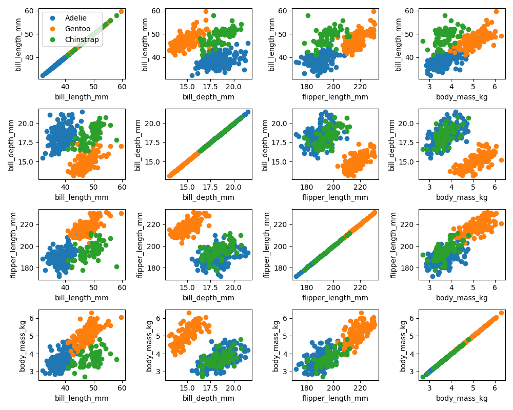
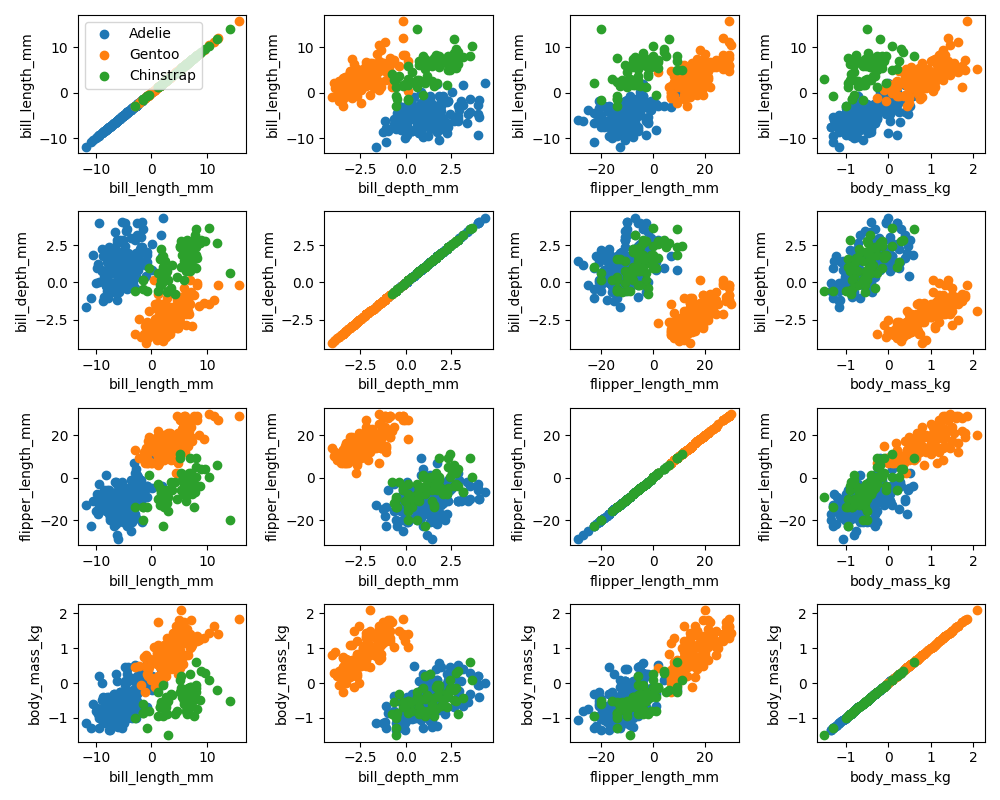
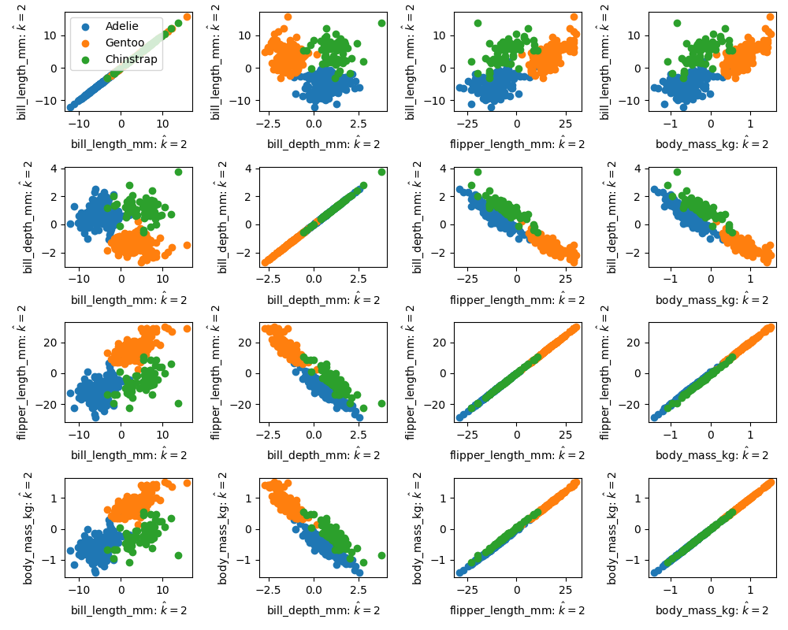

# Hauptkomponentenanalyse Ctd.

\newcommand{\Cov}{\operatorname{Cov}}
\newcommand{\bX}{{\mathbf{X}}}
\newcommand{\bxi}{{\mathbf{x} _ i}}
\newcommand{\bxj}{{\mathbf{x} _ j}}
\newcommand{\bxixj}{{\mathbf{x} _ i \mathbf{x} _ j}}

Im vorherigen Kapitel hatten wir einen zweidimensionalen Datensatz betrachtet und daf&uuml;r die Richtung bestimmt, in der die Varianz maximal wird. 
Da wir au&szlig;erdem ermittelt hatten, dass die Summe der Varianz unabh&uuml;ngig vom Koordinatensystem ist (es muss nur ein orthogonales sein) bedeutete das gleichzeitig, dass die verbleibende Richtung die Richtung der minimalen Varianz war.

Jetzt wollen wir einen Datensatz mit mehr Merkmalen betrachten und sehen, wie die algorithmische Herangehensweise zum Verst&auml;ndnis beitr&auml;gt. 

## Der PENGUINS Datensatz

Die Grundlage ist der [*Pinguin Datensatz*](https://allisonhorst.github.io/palmerpenguins/), der eine gern genommene Grundlage f&uuml;r die Illustration in der Datenanalyse ist. Die Daten wurden von [Kristen Gorman](https://www.uaf.edu/cfos/people/faculty/detail/kristen-gorman.php) erhoben und beinhalten 4 verschiedene Merkmale (engl. *features*) von einer Stichprobe von insgesamt 344^[allerdings mit 2 unvollst&auml;ndigen Datenpunkten, die ich entfernt habe f&uuml;r unseere Beispiele]Pinguinen die 3 verschiedenen Spezies zugeordnet werden k&ouml;nnen oder sollen (Fachbegriff hier: *targets*). Im Beispiel werden die Klassen mit `0, 1, 2` codiert und beschreiben die Unterarten *Adele*, *Gentoo* und *Chinstrap* der Pinguine. Die Merkmale sind gemessene L&auml;nge und H&ouml;he des Schnabels (hier *bill*), die L&auml;nge der Flosse (*flipper*) sowie das K&ouml;pergewicht ^[Im Originaldatensatz ist das Gewicht in Gramm angegeben, um die Daten innerhalb einer 10er Skala zu haben, habe ich das Gewicht auf in kg umgerechnet]
(*body mass*).

Wir stellen uns 2-3 Fragen:

1. W&uuml;rden eventuell 3 (oder sogar nur 2) Dimensionen reichen um den Datensatz zu beschreiben?
2. K&ouml;nnen wir aus den Merkmalen (*features*) die Klasse (*target*) erkennen und wie machen wir gegebenenfalls die Zuordnung?

## Darstellung

In h&ouml;heren Dimensionen ist schon die graphische Darstellung der Daten ein Problem. Wir k&ouml;nnen aber alle m&ouml;glichen 2er Kombinationen der Daten in 2D plots visualisieren.

{#fig:05-penguin-allpairs width="75%"}

Ein Blick auf die Diagonale zeigt schon, dass manche Merkmale besser geeignet als andere sind, um die Spezies zu unterscheiden, allerdings keine der Zweierkombinationen eine Eindeutige Diskriminierung erlaubt.

## Korrelationen und die Kovarianzmatrix

Als n&auml;chstes suchen wir nach Korrelationen in den Daten in dem wir f&uuml;r alle Merkmalpaare die Korrelationen ausrechnen. Daf&uuml;r berechnen wir die sogenannte *Kovarianzmatrix*
\begin{equation*}
\Cov(\mathbf X) = \begin{bmatrix}
\rho_{\bxixj}
\end{bmatrix}_{i,j=1,\dots n} \in \mathbb R^{n\times n}
\end{equation*}
wobei $n$ die Dimension der Daten ist und wobei
\begin{equation*}
s_{\bxixj} = \frac{1}{N-1} \sum_{k=1}^N (x_{ik}-\overline{\bxi})(x_{jk}-\overline{\bxj} ).
\end{equation*}
<!-- \begin{equation*}
\rho_{\bxixj} = \frac{s_{\bxixj}}{\sqrt{s_{\bxi\,\bxi}}\sqrt{s_{\bxj\,\bxj}}}
\end{equation*} -->
die Kovarianzen sind, die wir auch schon in der ersten Vorlesung kennengelernt haben.

Ist $\mathbf X\in \mathbb R^{N\times n}$ die Matrix mit den Datenvektoren $\bxi \in \mathbb R^{n}$ als Spalten **und ist der Datensatz zentriert** so erhalten wir die Kovarianzmatrix als
\begin{equation*}
\Cov(\bX) = \frac{1}{N-1}\bX^T \bX
\end{equation*}

Wir bemerken, dass auf der Hauptdiagonalen die Varianzen in Koordinatenrichtung stehen und in den Zeilen oder Spalten ein Mass daf&uuml;r, wie bspw. $\bxi$ und $\bxj$ korreliert sind. Gro&szlig;e Zahlen bedeuten eine gro&szlig;e Varianz oder eine starke Korrelation und umgekehrt. F&uuml;r die Datenanalyse k&ouml;nnen wir $\Cov(\bX)$ wie folgt heranziehen:

## Hauptachsentransformation

Wie im vorherigen Kapitel hergeleitet, bedeutet ein Koordinatenwechsel die Multiplikation der Datenmatrix $\bX\in \mathbb R^{N\times n}$ mit einer orthogonalen 
Matrix $V\in \mathbb R^{n\times n}$:
\begin{equation*}
\tilde \bX = \bX V,
\end{equation*}
wobei $\tilde \bX$ die Daten in den neuen Koordinaten sind (die Basisvektoren sind dann die Zeilenvektoren von $V$). Wir wollen nun eine Basis finden, in der

* $\Cov(\bX)$ eine Diagonalmatrix ist --- damit w&auml;ren alle Richtungen in den Daten *unkorreliert* und k&ouml;nnten *unabh&auml;ngig* voneinander betrachtet werden^[wir d&uuml;rfen aber nicht vergessen, dass Daten typischerweise nur eine Stichprobe von Beobachtungen eines Ph&auml;nomens sind. Die Unabh&auml;ngigkeit in den *features* gilt also nur f&uuml;r die gesammelten Daten aber in der Regel nicht f&uuml;r das Ph&auml;nomen. F&uuml;r normalverteilte Prozesse liefern die daten-basiert ermittelten Hauptrichtungen jedoch auch die Hauptrichtungen des zugrundeliegenden Ph&auml;nomens] --
* und in der die neuen Varianzen nach Gr&ouml;&szlig;e geordnet sind gleichzeitig die verf&uuml;gbare Varianz maximal in wenigen Richtungen konzentrieren.

Nachden den &Uuml;berlegungen im vorherigen Kapitel ist die erste Hauptrichtung durch den ersten rechten Singul&auml;rvektor $v_1\in \mathbb R^{n}$ der (*&ouml;konomischen*) Singul&auml;rwertzerlegung 
\begin{equation*}
\bX = U\Sigma V^* = 
\begin{bmatrix}
u_1 & u_2 & \dots & u_n
\end{bmatrix}
\begin{bmatrix}
\sigma_1 \\ &\sigma_2 \\ &&\ddots \\ &&&\sigma_n
\end{bmatrix}
\begin{bmatrix}
v_1^* \\ v_2 ^* \\ \vdots \\ v_n^*
\end{bmatrix}
\end{equation*}
von $\mathbf X\in \mathbb R^{N\times n}$ gegeben. Die zugeh&ouml;rigen Koeffizenten berechnen wir mittels 
\begin{equation*}
\tilde \bX = \bX v_1.
\end{equation*}

## Rekonstruktion

Um zu plausibilisieren, dass die weiteren Hauptachsen durch die weiteren (rechten) Singul&auml;rvektoren gegeben sind, betrachten wir erst die *Rekonstruktion*
also die Darstellung im Ausgangskoordinatensystem (mit den messbaren oder interpretierbaren Features) die durch
\begin{equation*}
\tilde {\tilde \bX} = \bX v_1v_1^T
\end{equation*}
gegeben ist.
Die letzte Formel wird vielleicht klarer, wenn Jan sich &uuml;berlegt, dass f&uuml;r einen Datenpunkt $\bX_j=\begin{bmatrix} x_{1j} &x_{2j} & \dots&  x_{nj}\end{bmatrix}$ (also die $j$-te Zeile von $\bX$), der Koeffizient f&uuml;r $v_1$ gegeben ist durch $\alpha_j=v_1^T\bX_j^T$ und die Darstellung im Vektorraum durch 
\begin{equation*}
\tilde{\tilde{ \bX}}_j=(\alpha_j v_1)^T = \alpha_j v_1^T = (v_1^T \bX_j^T) v_1^T  = \bX_j  v_1 v_1^T
\end{equation*}
gegeben ist.

Damit k&ouml;nnen wir mit 
\begin{equation*}
\bX - \tilde{\tilde {\bX}} = \bX(I-v_1v_1^T)
\end{equation*}
den Teil der Daten betrachten, der durch die Richtung $v_1$ nicht abgebildet wird (sozusagen den noch verbleibenden Teil). Jan kann nachrechnen, dass wiederum $U$ und $V$ die Singul&auml;rvektoren von $\bX-\tilde{\tilde {\bX}}$ bilden, mit jetzt $v_2$ als Richtung mit dem gr&ouml;&szlig;ten (verbleibenden) Singul&auml;rwert. 

Das hei&szlig;t, dass der $k$-te Singul&auml;rvektor die $k$-te Hauptrichtung bildet.

## Reduktion der Daten

Ist die Datenmatrix mit linear abh&auml;ngigen Spalten besetzt, &auml;u&szlig;ert sich das in $\sigma_k = 0$ f&uuml;r ein $k<n$ (und alle noch folgenden Singul&auml;rwerte). Jan rechnet nach, dass dann
\begin{equation*}
\bX = \bX V_{k-1}V_{k-1}^T
\end{equation*}
wobei $V_{k-1}$ die Matrix der $k-1$ f&uuml;hrenden Singul&auml;rvektoren ist und das entsprechende
\begin{equation*}
\tilde \bX = \bX V_{k-1}
\end{equation*}
alle Informationen des Datensatzes in kleinerer Dimension parametrisiert.

In der Praxis sind schon allein durch Messfehler exakte lineare Abh&auml;ngigkeiten sowie durch die n&auml;herungsweise Bestimmung auf dem Computer das Auftreten von $\sigma_k =0$ quasi ausgeschlossen. Stattdessen werden Schwellwerte definiert, unterhalb derer die SVD abgeschnitten wird.

Wie oben, werden dann die Daten $\tilde \bX=\bX V_{\hat k}$ in den (reduzierten) Koordinaten der Hauptachsen betrachtet sowie die Rekonstruktion $\hat \bX = \bX V_{\hat k}V_{\hat k}^T$, wobei der $V_{\hat k}$ die Matrix der $\hat k$ f&uuml;hrenden Singul&auml;rvektoren sind (mit Singul&auml;rwerten &uuml;berhalb des Schwellwertes).

## Am Beispiel der Pinguin Daten

Wir stellen die Daten noch einmal zentriert dar:

```{r 05-penguin-allpairs-cntrd, echo=FALSE, fig.cap='Pinguin Daten Zentriert', out.width='75%', fig.align='center'}

```


F&uuml;r die Kovarianzmatrix der Pinguin Daten erhalten wir:
```py
Covariance matrix: 
[[ 29.8071  -2.5342  50.3758   2.6056]
 [ -2.5342   3.8998 -16.213   -0.7474]
 [ 50.3758 -16.213  197.7318   9.8244]
 [  2.6056  -0.7474   9.8244   0.6431]]
```

F&uuml;r die Singul&auml;rwerte:

```py
In: U, S, Vh = np.linalg.svd(data, full_matrices=False)

In: print(S)
Out: [269.7858  74.1334  28.4183   7.2219]
```
Zwar ist hier kein Singul&auml;rwert nah an der Null, allerdings betr&auml;gt der Unterschied zwischen dem gr&ouml;&szlig;ten und dem kleinsten schon eine gute 10er Potenz, was auf eine starke Dominanz der ersten Hauptachsen hinweist. 

In der Tat, plotten wir die Daten in den Koordinaten der Hauptachsen (also $\tilde \bX$), zeigen Bilder der $v_1$ oder $v_2$-Koordinaten klare Tendenzen in den Daten, w&auml;hrend die Plots der &uuml;brigen Richtungen wie eine zuf&auml;llige Punktwolke aussieht, vgl. die Abbildung [hier](#fig:05-penguin-allpairs-pcs).

{#fig:05-penguin-allpairs-pcs width="75%"}

Als letztes plotten wir noch $\hat {\bX}$ f&uuml;r $\hat k =2$. Das hei&szlig;t wir reduzieren die Daten auf die $v_1$ und $v_2$-Richtungen und betrachten die Rekonstruktion. Im Plot sehen wir, dass in gewissen Teilen die Daten gut rekonstruiert werden. Allerdings, hat $\hat{\bX}$ nur Rang $\operatorname{Rk} \hat {\bX}=2$ (warum?), sodass in den Plots notwendigerweise direkte lineare Abh&auml;ngigkeiten offenbar werden.

{#fig:05-penguin-allpairs-k2-rec width="75%"}


## Aufgaben

### Kovarianzen (P+T)

Erzeugen Sie f&uuml;r `N` aus `Nl = [10, 1000, 100000]` zuf&auml;llige Vektoren `x` und `y` der L&auml;nge `N` und berechnen Sie
f&uuml;r den Datensatz `X = [x, x, x*y, y]`
jeweils die Matrix der Korrelationskoeffizienten 
\begin{equation*}
\rho _{i\;j} = \frac{s_{i\, j}}{s_i \cdot s_j}
\end{equation*}
wobei $s_{i\,j}$ die Kovarianz der Daten $\bxi$ und $\bxj$ ist und $s_{i}$ die Varianz von $\bxi$. Interpretieren sie die Ergebnisse.

**Hinweis**: Weil Zuf&auml;lligkeit involviert ist, ist die Interpretation manchmal schwierig. Lassen sie das Programm &ouml;fter laufen und beobachten sie verschiedene Realisierungen der Stichproben.

```py
import numpy as np

# N = 10

x = np.random.randn(10, 1)
y = np.random.randn(10, 1)

X = np.hstack([x, x, x*y, y])

Xcntrd = X - X.mean(axis=0)
# zentrieren der Daten

# Kovarianz Matrix ausrechnen
covX = 1/(10-1)*Xcntrd.T @ Xcntrd

# Varianzen -- stehen auf der Diagonalen im Quadrat
varvec = np.sqrt(np.diagonal(covX)).reshape(4, 1)
# Matrix mit den Kombinationen aller Varianzen
varmat = varvec @ varvec.T

matcc = covX * 1/varmat

print(f'N={10} : Matrix of Correlation Coefficients=')
print(matcc)
```

### Pinguin Datensatz -- Targets Plotten (P)

Laden Sie die [Pinguin Datensatz](bilder/penguin-data.json) (hier als `json` file bereitgestellt) und plotten sie `bill_length` versus `flipper_length` f&uuml;r die drei Spezies `Adelie`, `Gentoo`, `Chinstrap` in drei separaten Grafiken.

```py
import json

import numpy as np
import matplotlib.pyplot as plt

with open('penguin-data.json', 'r') as f:
    datadict = json.load(f)

print(datadict.keys())

data = np.array(datadict['data'])
target = np.array(datadict['target'])
feature_names = datadict['feature_names']
target_names = datadict['target_names']

print('target names: ', target_names)
print('feature names: ', feature_names)

fig, axs = plt.subplots(nrows=1, ncols=3, figsize=(10, 3))

# # Ein Vektor der aus dem Target Vektor das target 0 raussucht
trgtidx_z = (target == 0)
# # Wird gleich benutzt um die Daten nach diesem target zu filtern

target_z_daten = data[trgtidx_z, :]

axs[0].plot(target_z_daten[:, 2], target_z_daten[:, 0],
            'o', label=target_names[0])

axs[0].legend()
axs[0].set_xlabel(feature_names[3])
axs[0].set_ylabel(feature_names[0])
axs[0].set_title(target_names[0])

plt.tight_layout()
plt.show()
```


Hier wurden die `python` Datentypen

 * *list* -- z.B. `datenpunkte = [1, 2, 3]` 
 * *array* -- z.B. `datenmatrix = np.array(datenpunkte)`
 * *dictionary* -- z.B. `datadict = {'data': datenpunkte}`

verwendet, die alle f&uuml;r verschiedene Zwecke gerne benutzt werden. Z.B.

 * Liste -- als eine Sammlung von (m&ouml;glicherweise total unterschiedlichen) Objekten, &uuml;ber die iteriert werden kann und die einfach zu erweitern ist
 * `arrays` -- Matrix/Vektor von Daten eines Typs, mit denen *gerechnet* werden kann
 * `dictionaries` -- ein *Lookup table*. Objekte k&ouml;nnen &uuml;ber einen Namen addressiert werden. Ich nehme sie gerne um Daten mit ihrem Namen zum Beispiel als `json` file zu speichern.

### Pinguin Datensatz -- 2D plots (P)

Erzeugen sie die [Abbildung aller Merkmalpaare](#fig:05-penguin-allpairs) zum Beispiel &uuml;ber ein `4x4` Feld von subplots
```py
fig, axs = plt.subplots(nrows=4, ncols=4, figsize=(10, 8))
```
erzeugen, in das sie mittels
```py
axs[zeile, spalte].plot(xdaten, ydaten, 'o')
```
die plots fuer die einzelnen targets "eintragen" koennen. Bitte die Achsen beschriften (die `legend` ist nicht unbedingt notwendig).

### Kovarianz (P)

Zentrieren Sie den Datensatz (zum Beispiel unter Verwendung der `numpy.mean` Funktion) und berechnen Sie die Kovarianzmatrix.

### Hauptachsentransformation (P)

Berechnen sie Hauptachsen und stellen Sie die Daten in den Hauptachsenkoordinaten dar (wie in [dieser Abbildung](#fig:05-penguin-allpairs-pcs)).

### Kovarianzmatrix (T)

Zeigen sie, dass f&uuml;r zentrierte Datens&auml;tze $\bX\in \mathbb R^{N\times n}$ gilt, dass
\begin{equation*}
\Cov(X) = \frac{1}{N-1}\bX^T\bX.
\end{equation*}

### Gesamtvarianz (T)

Zeigen sie, dass auch f&uuml;r $n>2$ die Summe der Varianzen in orthogonalen Achsenrichtungen unabh&auml;ngig von der Wahl des Koordinatensystems sind. (Vergleiche Kapitel 4.2 Koordinatenwechsel)
