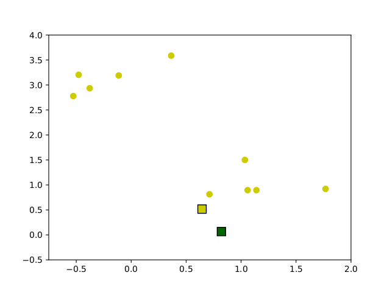
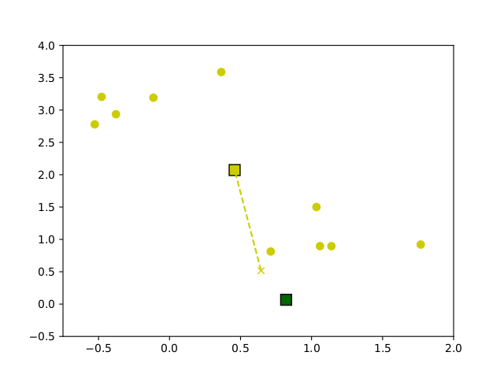
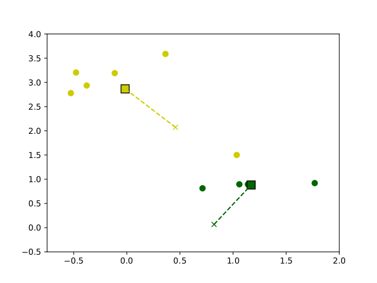
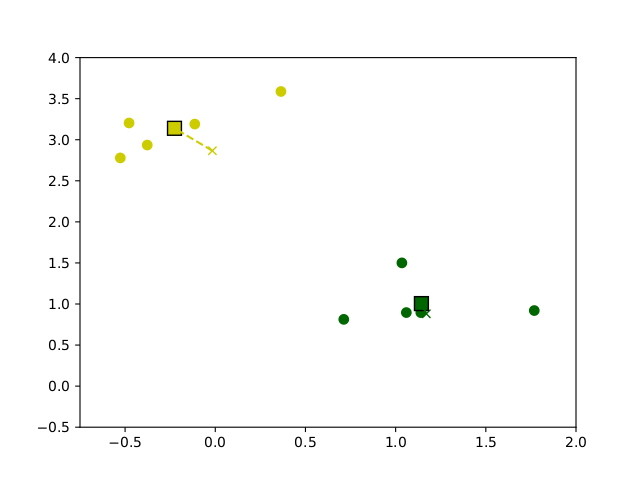
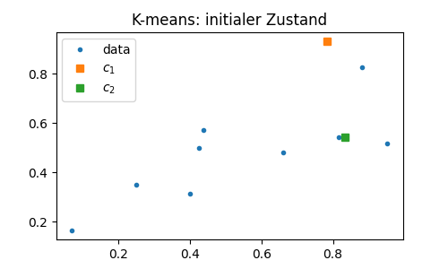
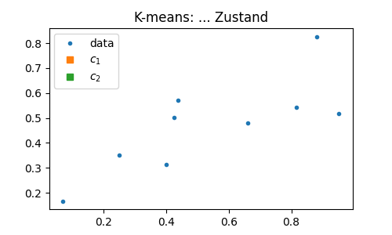

# Clustering und Hauptkomponentenanalyse

Mit der Hauptkomponentenanalyse haben wir eine Methode kennengelernt, Daten gem&auml;&szlig; in Koordinaten darzustellen, die nach inhaltsschwere^[wenn wir Inhalt mit Varianz gleich setzen] absteigend sortiert sind. Die Konzentrierung der Varianz in den Hauptachsenrichtungen erm&ouml;glicht uns

1. die Hauptkomponenten zu ermitteln, die den Datensatz optimal in niedrigerer Dimension darstellen (wobei optimal hier bedeutet dass die Varianz in der Differenz $\bX-\hat \bX$ minimal ist)
2. und in diesem Sinne die Daten optimal auf niedrigere Dimensionen zu reduzieren.

::: {#rem-clustering-goal .JHSAYS data-latex=''}
Die noch offene Frage war, ob wir mit universalen Methoden aus den Merkmalen (oder deren Kombination) auf die Spezies schliessen k&ouml;nnen.
:::

Ein einfacher Blick auf die Plots der Pinguin Merkmale (Abbildung \@ref(fig:05-penguin-allpairs-cntrd)) l&auml;&szlig;t uns schlie&szlig;en, dass 

* ein Merkmal (z.B. `bill_depth`) auf jeden Fall nicht ausreichend ist f&uuml;r eine Unterscheidung) aber
* zwei Merkmale (z.B. `bill_length` vs. `flipper_length`) die farbigen Punkte (also die Spezies) schon etwas im Raum separieren, w&auml;hrend 
* mehrere Merkmale die Datenwolken im h&ouml;her-dimensionalen Raum eventuell noch besser separieren, dass aber schwerlich nachvollziehbar ist.

Im 2D Fall allerdings, w&uuml;rde Jan einen zus&auml;tzlich gefundenen Pinguin vermessen, den neuen Datenpunkt im Diagramm eintragen und dann schauen, in welchem Bereich er landet um daraus die Spezies abzuleiten. Alles mit reichlich Vorwissen (z.B. dass es 3 Spezies gibt und welche Merkmale die Unterscheidung am besten erlauben).

F&uuml;r allgemeine F&auml;lle wird die Identifikation der Bereiche (manchmal ist es sogar gar nicht klar wieviele Bereiche n&ouml;tig oder zielf&uuml;hrend sind) und die Zuweisung der Datenpunkte von sogenannten **clustering** Algorithmen &uuml;bernommen.

## Clustering im Allgemeinen

Das Ziel ist es in einer Datenwolke Bereiche (**cluster**) zu identifizieren, sodass die vorhandenen (oder auch neu hinzukommende) Datenpunkte anhand ihrer Merkmale den Bereichen zugeordnet (*klassifiziert*) werden k&ouml;nnen.

Je nach Anwendungsfall und Vorwissen kann diese Aufgabe verschieden definiert werden

 * Ist die Anzahl der cluster bekannt (wie bei unseren Pinguinen wo es einfach 3 Arten zu unterscheiden gibt), soll der Datenraum optimal in entsprechend viele nicht &uuml;berlappende Bereiche geteilt.
 * Anderenfalls sollen die Anzahl der Cluster und die zugeh&ouml;rigen Bereiche simultan optimal bestimmt werden.

Typischerweise werden die cluster durch ihre Mittelpunkte (**centroids**) $c_j\in \mathbb R^{n}$ bestimmt, $j=1,\dots,K$, wobei $K$ die Anzahl der cluster ist sowie eine Zuweisungsregel $k\colon \bxi \mapsto \{1,\dots,K\}$ die zu einem Datenpunkt das entsprechende cluster aussucht. Die Zuweisung passiert generell so, dass einem Datenpunkt $\bxi$ der naheste Zentroid zugewiesen wird, also $k(\bxi)$ ist der Index $j^*$, sodass
\begin{equation*}
\|\bxi - c_{j^*}\| = \min_{j=1,\dots K} \|\bxi - c_{j^*}\|
\end{equation*}

Die Qualit&auml;t des clusterings wird &uuml;ber die summierte Differenz 
\begin{equation*}
e = \sum_{i=1}^N\|\bxi - c_{k(\bxi)}\|
\end{equation*}
bewertet.

::: {#cluster-norms .JHSAYS data-latex=''}
Wir sehen, dass zum Bewerten (und damit Definieren) der Cluster eine Norm (oder auch einfach eine Metrik) benutzt und machen uns klar, dass das Ergebnis des clusterings stark von der Wahl der Norm abh&auml;ngen kann.
:::

Ist die Anzahl der Cluster nicht vorgegeben, ist wiederum ein guter Kompromiss zwischen 

 * *overfitting* -- je h&ouml;her die Anzahl der cluster ist, desto "n&auml;her" k&ouml;nnen die Daten an den centroids liegen, allerdings wird die Klassifizierung oder Kategorisierung weniger aussagekr&auml;ftig wenn quasi jeder Datenpunkt sein eigenes cluster bildet.

 * *underfitting* -- wenige Cluster erlauben zwar sehr konkrete Gruppierung von Daten, allerdings mit dem m&ouml;glichen Nachteil, dass wesentliche Merkmale nicht ber&uuml;cksichtigt oder falsch klassifiziert werden

In der Praxis behilft Jan sich gerne mit einer *L-Kurve* (oder auch *ellbow plot*), die den Klassifikationsfehler gegen&uuml;ber der Anzahl der zugelassenen cluster auftr&auml;gt: Diese Kurve $e(K)$ ist -- in der Theorie -- positiv, maximal f&uuml;r $K=1$ und f&auml;llt monoton mit der Anzahl $K$ der cluster. Zeigt diese Kurve einen merklichen Knick bei $K^*$ wird dieser Wert gerne als passender Kompromiss genommen.


## K-means Clustering

Aus der Definition und der Bewertung der Cluster ergibt sich ein einfacher aber sehr oft und erfolgreich genutzter Algorithmus zum clustering, der *k-means* Algorithmus. Er funktioniert wie folgt


```{.py .numberLines}
# Initialisierung: K zufaellige centroids c_j
#
# Wiederholung bis zur Stagnation
#   Berechnung der Zuordnung: k: x_i -> c_j
#   Update der centroids: c_j <- mean{ x_i | x_i aus cluster c_j }
```

Ausgehend von zuf&auml;llig gew&auml;hlten centroids, wird die Zuordnung berechnent und dann der Mittelwert aus jedem Cluster als neuer centroid definiert. Dieses Verfahren wird solange wiederholt bis eine maximale Iterationszahl erreicht ist oder die centroids sich nur noch wenig oder gar nicht mehr ver&auml;ndern. In Abbildung \@ref(fig:k-means-evoexa) ist eine beispielhafte Ausf&uuml;hrung des Algorithmus auf Beispieldaten dargestellt.

<!--{width="30%"}-->

<div class="figure" style="text-align: center">

<p class="caption">(\#fig:k-means-evoexa)Entwicklung der Centroids im Verlauf des k-means clustering Algorithmus auf Beispieldaten</p>
</div>

## Clustering und Hauptkomponentenanalyse 

Der k-means Algorithmus basiert allein auf der Bestimmung von Abst&auml;nden und Mittelwerten -- beides kann in beliebigen Dimensionen $n$ der Daten realisiert werden. Allerdings ist die Klassifizierung in h&ouml;heren Datendimensionen ungleich schwieriger da

 * f&uuml;r eine vergleichsweise &auml;hnlich gro&szlig;e Einzugsbereiche, m&uuml;ssen ungleich mehr clusters verwendet werden. Beispielsweise l&ouml;&szlig;t sich ein Quadrat der Seitenl&auml;nge 2 in $4=2^2$ Quadrate der Gr&ouml;&szlig;e 1 aufteilen. F&uuml;r einen W&uuml;rfel (eine Dimension mehr), braucht Jan entsprechend $8=2^3$ (das heisst doppelt so viele) Unterbereiche. In vier Dimensionen w&auml;ren es bereits $2^4$. Und so weiter.

 * die Berechnung der Abst&auml;nde und Zuordnung zu den clusters wird aufw&auml;ndiger

 * es gibt ungleich mehr Konfigurationen f&uuml;r die centroids. Es braucht unter Umst&auml;nden mehr Iterationen um einen stabilen Zustand zu erreichen.

Ein einfacher Zugang w&auml;re es, eine reduzierte Anzahl der Merkmale zur Klassifizierung einzusetzen. Allerdings wird die Qualit&auml;t der Klassifizierung davon abh&ouml;ngen, wie geeignet die ausgesuchten Merkmale daf&uuml;r sind. Ein Blick auf die verschiedenen Plots in Abbildung \@ref(fig:05-penguin-allpairs) kann helfen zu verstehen, dass manche Paare von Koordinaten besser als andere geeignet sind um die 3 Pinguinarten zu unterscheiden.

Folgen wir hingegen der Annahme, dass eine hohe Varianz einen hohen Informationsgehalt bedeutet, k&ouml;nnen wir die Hauptkomponentenanalyse einsetzen um Richtungen von h&ouml;chster Varianz zu identifizieren und auch Richtungen die &uuml;berhaupt keine Korrelationen aufzeigen auszuschlie&szlig;en. In der Tat suggerieren die Plots der Pinguindaten in den Hauptkoordinaten (Abbildung \@ref(fig:05-penguin-allpairs-pcs)), dass die ersten Hauptrichtungen die Spezies gut unterscheiden, w&auml;hrend die letzten Richtungen ein scheinbar zuf&auml;lliges Rauschen zeigen. 

::: {#rem-pca-clustering .JHSAYS data-latex=''}
Auch wenn die Hauptrichtungen die Daten nicht unbedingt besser separieren, erm&ouml;glichen sie doch das ausschlie&szlig;en der (transformierten) Merkmale ohne Informationsgehalt und damit einen strukturierten und allgemeinen Ansatz zur Klassifizierung hochdimensionaler Daten mit reduzierten Merkmalen.
:::

## Training und Testing

Das Klassifizieren ist ein erstes konkretes Beispiel daf&uuml;r, wie aus Daten ein Modell abgeleitet wird. F&uuml;r die gemessenen Pinguine kennen wir die Spezies, das Ziel ist, ein Modell zu haben mit dem wir zuk&uuml;nftig angetroffene Pinguine anhand ihrer gemessenen Merkmale klassifizieren k&ouml;nnen.

Allgemein wird f&uuml;r einen solchen neuen Datenpunkt wie folgt vorgegangen

1. (Gegebenenfalls) Normalisierung des Datenpunktes durch Skalierung und Abziehen des (zuvor ermittelten) Mittelwertes.
2. (Gegebenenfalls) Transformation in (reduzierte) Hauptkoordinaten.
3. Test zu welchen centroid $c_j$, $j=1,\dots,K$ der (transformierte) Datenpunkt am n&auml;chsten liegt.

Der in (3.) ermittelte Index $j^*$ ist dann das Cluster, dem der Datenpunkt zugeordnet wird. 

Der Sprachgebrauch hier ist, dass das Modell mit bekannten Daten *trainiert* wird und dann f&uuml;r neue Daten *angewendet* wird^[Im *machine learning* wird gerne von *generalization* gesprochen]. Um zu evaluieren, ob das Modell "funktioniert" ist das folgende Vorgehen ebenso naheliegend wie standardm&auml;&szlig;ig angewandt.

Die vorhandenen Daten werden aufgeteilt in **Trainingsdaten**, mit denen das Modell trainiert werden, und **Testdaten**, mit denen die Vorhersagekraft des Modells evaluiert wird. Wie die Aufteilung passiert, wird anhand von Erfahrungswerten und im Hinblick auf die vorliegende Aufgabe entschieden.

## Am Beispiel der Pinguine

## Aufgaben

### K-means von Hand (T)

F&uuml;hren sie h&auml;ndisch und nach Augenschein zwei Iterationen des K-means Algorithmus auf den vom folgenden Skript erzeugten `(x,z)` Daten durch. Dazu bitte, Beispielsweise in Abbildung \@ref(fig:k-means-evoexaexrcs), in jedem Schritt die Clusterzugeh&ouml;rigkeiten markieren und die neuen (gesch&auml;tzten) Mittelpunkte $c_1$ und $c_2$ eintragen.

```{.py}
from numpy.random import default_rng
import matplotlib.pyplot as plt

# Zufallszahlengenerator mit "seed=1"
rng = default_rng(1)

# Zufallsdaten mit etwas Korrelation fuer z
x = rng.beta(1, 1, 9)
y = rng.beta(1, 1, 9)
z = (x*x*y)**(1/3)

# Zufallswahl der initialen centroids
cntro = rng.beta(1, 1, 2)
cntrt = rng.beta(1, 1, 2)

plt.figure(1, figsize=(5, 3))
plt.plot(x, z, '.', label='data')
plt.plot(cntro[0], cntro[1], 's', label='$c_1$')
plt.plot(cntrt[0], cntrt[1], 's', label='$c_2$')
plt.legend(loc='upper left')
plt.title('K-means: initialer Zustand')
plt.show()
```

<div class="figure" style="text-align: center">

<p class="caption">(\#fig:k-means-evoexaexrcs)Bitte gerne hier die Evolution einzeichnen</p>
</div>

### K-means als Algorithmus (P)

Schreiben sie eine Funktion, die mittels des k-means Algorithmus einen Datensatz in beliebiger Dimension in `K` vorgegebene cluster gruppiert und die labels der Daten sowie die Koordinaten der centroids zurueckgeben.

Testen sie die Funktion am obigen theoretischen Beispiel.

Hier [zum Download angeh&auml;ngt](bilder/kmeans_utils.py) eine Datei mit ein paar hilfreichen Routinen und schon einer Vorgabe f&uuml;r die "Hauptroutine". **Bitte machen Sie sich damit vertraut, wie in Python Routinen aus einem *module* (d.h. einer anderen Datei mit Python Funktionen) importiert werden kann.**

```{.py}

```

### K-means fuer die Pinguine

Wenden sie den Algorithmus auf die (zentrierten und auf in jeder Richtung auf $[-1, 1]$ skalierten) Pinguindaten an. Und vergleichen sie mit den Bildern oben.

1. In der gesamten Datendimension
2. F&uuml;r zwei beliebig gew&auml;hlte Merkmale
3. F&uuml;r die ersten drei Hauptkomponenten

```{.py}
from numpy.random import default_rng
from numpy.linalg import norm

import matplotlib.pyplot as plt
import numpy as np

# Zufallszahlengenerator mit "seed=1"
rng = default_rng(1)


def get_labels(datamatrix, centroids=None):
    ''' find the nearest of given centroids for data

    Parameters
    ----------
    datamatrix: (N, n) array
        the data of N data points with n features each
    centroids: list
        of K centroid coordinates of shape (1, n) each
    '''

    listofdiffs = []
    Ndata = datamatrix.shape[0]
    for cj in centroids:
        cjdiff = norm(datamatrix-cj, axis=1)
        listofdiffs.append(cjdiff.reshape((Ndata, 1)))
    arrayofdiffs = np.hstack(listofdiffs)  # better for computing and indexing
    clabels = np.argmin(arrayofdiffs, axis=1)
    vecoferrs = np.min(arrayofdiffs, axis=1)
    clstrerror = norm(vecoferrs)  # the clustering error
    return clabels, clstrerror


def get_centers(datamatrix, K=None, labels=None):
    ''' compute centroids for given clusters

    Parameters
    ----------
    datamatrix: (N, n) numpy array
        the data of N data points with n features each
    labels: list
        of labels that associate data points with clusters
    K: int
        number of clusters
    '''

    newcntrds = []
    for clstr in range(K):
        if (labels == clstr).sum() > 0:
            dataincj = datamatrix[labels == clstr, :]
            newcj = np.mean(dataincj, axis=0)
            newcntrds.append(newcj)
        else:
            # if no points in cluster -- use random datapoint as centroid
            rnddidx = np.random.randint(datamatrix.shape[0])
            newcntrds.append(datamatrix[rnddidx, :])

    return newcntrds


def kmeans(datamatrix, K, maxiter=10, itertol=1e-10, cntrdlist=None):
    ''' compute clusters for data by k-means

    Parameters
    ----------
    datamatrix: (N, n) numpy array
        the data of N data points with n features each
    K: int
        number of clusters
    maxiter: int, optional
        max number of iterations, defaults to 10
    itertol: float, optional
        tolerance to terminate the iteration, defaults to 1e-10
    cntrdlist: list, optional
        of coordinates to be used as initial cluster
    '''

    if cntrdlist is None:
        # Random centroid initialization
        cntrdlist = []
        for kkk in range(K):
            rnddidx = np.random.randint(datamatrix.shape[0])
            cntrdlist.append(datamatrix[rnddidx, :])
    elif not len(cntrdlist) == K:
        raise RuntimeError('number of initial centroids unequals `K`')
    else:
        pass
    clabels, olderror = get_labels(datamatrix, centroids=cntrdlist)

    for kkk in range(maxiter):
        cntrdlist = get_centers(datamatrix, K=K, labels=clabels)
        clabels, newerror = get_labels(datamatrix, centroids=cntrdlist)
        if np.abs(olderror-newerror) < itertol:
            print(f'iteration {kkk}: change in error below {itertol:.2e}')
            break
        else:
            olderror = newerror
    return cntrdlist, clabels, newerror


def plot_cluster_data(datamatrix, labels, cntrdlist,
                      xlabel='feature', ylabel='other feature',
                      fignum=10101, figsize=(5, 4), titlestr='Clustering'):
    plt.figure(fignum, figsize=figsize)

    # Set the colors for the plots
    clm = np.linspace(0.2, 0.8, len(cntrdlist))
    plt.rcParams["axes.prop_cycle"] = \
        plt.cycler("color", plt.cm.plasma(clm))
    # done setting colors

    for kkk in range(len(cntrdlist)):
        cdata = datamatrix[labels == kkk, :]
        plt.plot(cdata[:, 0], cdata[:, 1], '.', alpha=.7)
    for kkk in range(len(cntrdlist)):
        plt.plot(cntrdlist[kkk][0], cntrdlist[kkk][1],
                 's', label=f'$c_{kkk+1}$')

    plt.title(titlestr)
    plt.xlabel(xlabel)
    plt.ylabel(ylabel)
    plt.legend(loc='upper left')
    plt.legend()
    plt.tight_layout()
    plt.show(block=False)
    return
```

::: {#clustering-random .JHSAYS data-latex=''}
Achtung -- auch hier ist wieder Zufall involviert. Wenn das Ergebnis seltsam aussieht, gegebenfalls das Experiment mehrfach wiederholen um auszuschlie&szlig;en, dass es sich nur um einen statistischen Ausrei&szlig;er handelt.
:::


### L-curve

Bestimmen sie die L-Kurve fuer die Pinguindaten fuer `K=1,2,3,4,...,8` -- fuer das clustering auf dem gesamten Datensatz.
